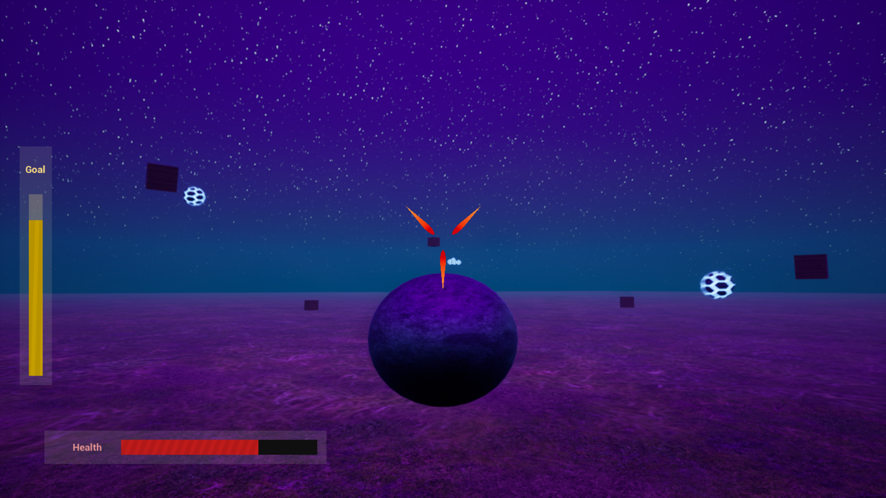

# Out-Of-Space

## Description

You are in space and enemies try to destroy you, you have to make it out!

### Controls

|Action|Gamepad|Keyboard|
|---|---|---|
|Move forward|A|W/Spacebar|
|Roll left|Q|LB|
|Roll right|E|RB|
|Look direction|Left stick|Mouse|
|Fire|Trigger/X|Left mouse button/F|
|Aim|Right stick|Mouse|
|Pause|Start|Escape|

## Parts

### gameplay
- gameplay (navigation, aim/lock, fire, enemy moving)
- sounds (engine, roll, hit, death)
- music (menu + gameplay)
- menus (with version number)
- world (add meteorite)
- profile drawings
- story lines

## bugs

- player is dead, can win if a projectile kills last enemy after death
